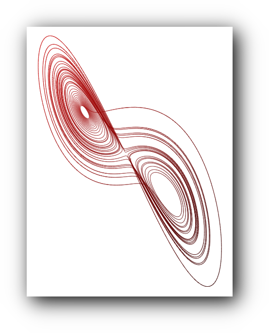

# Lorenz Attractor

This repository contains an example of HTML, CSS and JavaScript for beginners.

Try it here: **https://tkoster.github.io/lorenz**

The web page displays an HTML form for visualising a [Lorenz Attractor](https://en.wikipedia.org/wiki/Lorenz_system), a type of dynamical system described by an ordinary differential equation. The Lorenz system is known as a "strange attractor" due to its unpredictable and chaotic behaviour.

The user can enter parameters as a fraction. For example `1/2` is accepted as an alternative to `0.5`.

When the user clicks 'Calculate', the ordinary differential equation is calculated with those parameters and plotted on an HTML canvas using an orthogonal 2D projection.

