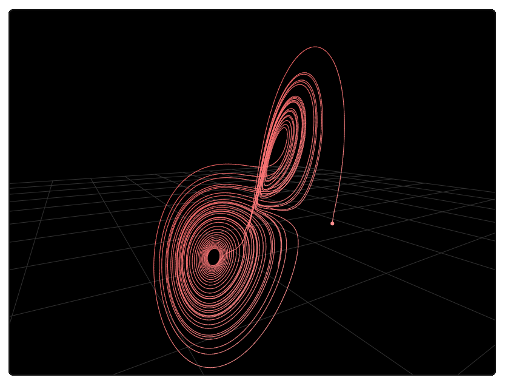

# Lorenz Attractor

This project is a simple website for visualising a [Lorenz Attractor](https://en.wikipedia.org/wiki/Lorenz_system), a type of dynamical system described by an ordinary differential equation. The Lorenz system is known as a "strange attractor" due to its unpredictable and chaotic behaviour.

This project is a web programming example in the "from scratch" style to show basic concepts of interactive HTML forms, numerical integration and 3D graphics.

Try it here: **https://tkoster.github.io/lorenz**

## Usage

The solution of the differential equation is plotted using a perspective 3D projection on an HTML canvas. The viewpoint can be moved interactively by clicking and dragging the mouse over the canvas. Use the mouse wheel to change the distance from the eye to the curve.

Parameters can be entered as a fraction. For example `1/2` is accepted as an alternative to `0.5`.

## Implementation Notes

This project is a web programming example in the "from scratch" style.

The differential equation solver and linear algebra functions are written in JavaScript using ordinary arrays. No JavaScript libraries are used. No WebGL is used.

The following browser APIs are used:
- [Document Object Model](https://developer.mozilla.org/en-US/docs/Web/API/Document_Object_Model) to access the interactive page elements from JavaScript, including
  - [Pointer Events](https://developer.mozilla.org/en-US/docs/Web/API/Pointer_events) and the [Pointer Lock API](https://developer.mozilla.org/en-US/docs/Web/API/Pointer_Lock_API) to implement click-and-drag
- [Canvas API](https://developer.mozilla.org/en-US/docs/Web/API/Canvas_API) to draw the 2D curve

No optimisations are implemented except eliding 2D curve points that are too close to the previous point on the curve to be distinct.

## Known Issues

- No frustum clipping - elements behind the camera are drawn incorrectly
- Non-square aspect ratio in the perspective projection transformation
- Poor support for mobile and tablet devices
